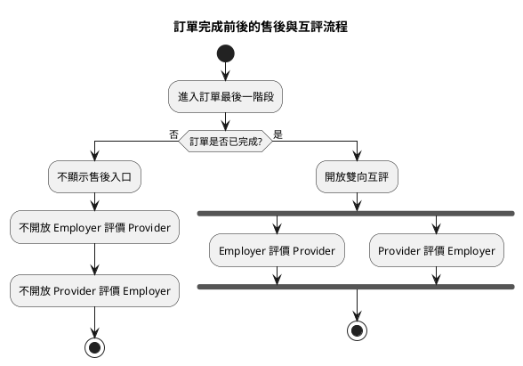
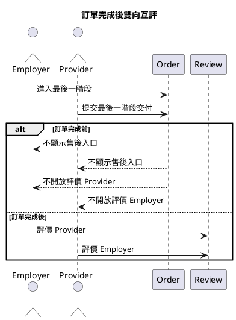

# mecheck

## 訂單完成前後的售後與互評流程

規則調整重點：

- 訂單完成前，即使進入最後一階段，也不顯示售後入口。
- 訂單完成後，才開放 Employer 與 Provider 雙向互評。
- Employer -> Provider 與 Provider -> Employer 都套用同一套判斷。

### UML 活動圖

```plantuml
@startuml
title 訂單完成前後的售後與互評流程

start
:進入訂單最後一階段;

if (訂單是否已完成?) then (否)
  :不顯示售後入口;
  :不開放 Employer 評價 Provider;
  :不開放 Provider 評價 Employer;
  stop
else (是)
  :開放雙向互評;
  fork
    :Employer 評價 Provider;
  fork again
    :Provider 評價 Employer;
  end fork
  stop
endif

@enduml
```

### UML 序列圖

```plantuml
@startuml
title 訂單完成後雙向互評

actor Employer
actor Provider
participant Order
participant Review

Employer -> Order : 進入最後一階段
Provider -> Order : 提交最後一階段交付

alt 訂單完成前
  Order --> Employer : 不顯示售後入口
  Order --> Provider : 不顯示售後入口
  Order --> Employer : 不開放評價 Provider
  Order --> Provider : 不開放評價 Employer
else 訂單完成後
  Employer -> Review : 評價 Provider
  Provider -> Review : 評價 Employer
end

@enduml
```
